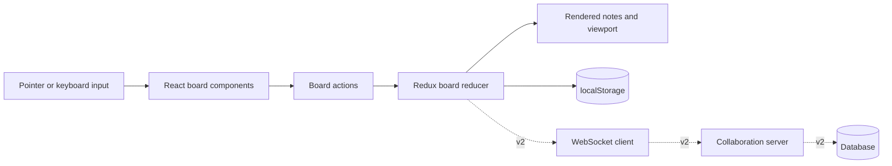

# Gatherboard: project and learning plan

**Current status:** v0 complete — September 4, 2026

## Why this project exists

Gatherboard is a small collaborative-canvas project inspired by visual workspaces such as FigJam. The goal is not to reproduce a commercial product. It is to build a focused system that teaches spatial UI design, client-side state modeling, accessibility, persistence, and eventually real-time collaboration.

This project also tests a deliberate way of working with AI: use the assistant to remove configuration and repetitive boilerplate while keeping the high-learning-value engineering decisions visible and reviewable.

## Product statement

Gatherboard helps people arrange ideas spatially using editable sticky notes. The first release is a complete single-user experience. Later releases will add persistence on a server and multiplayer collaboration without replacing the core interaction model.

## Version roadmap

### v0: single-user board

The first version is complete when a user can:

- Create, edit, recolor, move, and delete sticky notes.
- Pan and zoom an effectively unbounded workspace.
- move a focused note with `Alt` plus the arrow keys.
- Undo and redo note changes.
- Reload the page without losing the board.
- Operate the core workflow with a keyboard.
- Use the experience with reduced-motion preferences.
- Run unit, component, and end-to-end tests locally.

### v1: persistent boards

- Create named boards with shareable URLs.
- Load and save through a Node API.
- Persist board data in SQLite or Postgres.
- Show explicit loading, saved, offline, and error states.
- Add schema validation at the client/server boundary.

### v2: multiplayer collaboration

- Synchronize board operations through WebSockets.
- Show participant presence and live cursors.
- Apply optimistic local updates.
- Reconnect and recover after temporary network loss.
- Define and test a conflict-resolution policy.

### v3: portfolio release

- Deploy the client and collaboration service.
- Add connection lines and multi-select.
- Profile and document rendering performance.
- Run automated accessibility checks.
- Publish an architecture write-up and recorded demo.

## Architecture



The v0 app deliberately separates document state from view state:

- **Document state** is the collection of sticky notes. It belongs in undo history and is persisted.
- **View state** is the current pan and zoom. It changes frequently, does not pollute undo history, and is persisted independently.
- **Transient interaction state** describes an active drag or pan. It stays inside the board component and is committed only when an interaction ends.

## Data model

```ts
type StickyNote = {
  id: string;
  text: string;
  color: "yellow" | "pink" | "blue" | "green";
  position: { x: number; y: number };
};

type BoardDocument = {
  notes: StickyNote[];
};

type Viewport = {
  x: number;
  y: number;
  zoom: number;
};
```

## Important interaction flow

```mermaid
sequenceDiagram
    participant Person
    participant Note as StickyNote
    participant Board
    participant Store
    participant Storage as localStorage

    Person->>Note: Pointer down on drag handle
    Note->>Board: Start drag with pointer and note origin
    Person->>Board: Pointer moves
    Board->>Board: Convert screen delta using zoom
    Board-->>Person: Preview note at transient position
    Person->>Board: Pointer up
    Board->>Store: moveNote(id, finalPosition)
    Store-->>Board: Render committed document
    Store->>Storage: Persist updated board
```

Keeping pointer-move previews transient prevents a single drag from generating dozens of undo entries.

## Accessibility decisions

- Every action has a visible button or native form control.
- Sticky-note text uses a labelled `<textarea>` rather than a custom editable element.
- A focused note can move using `Alt` plus an arrow key.
- Status changes are announced through a polite live region.
- Canvas panning is available through arrow keys and visible controls, not pointer input alone.
- Controls have strong focus indicators and meet target-size expectations.
- Reduced-motion preferences disable decorative transitions.
- Color is never the only way an action or state is identified.

## Testing strategy

### Unit tests

- Screen-to-board coordinate conversion.
- Zoom clamping and zoom-around-pointer math.
- Reducer history behavior.
- Add, move, edit, recolor, delete, undo, and redo actions.

### Component tests

- Creating and editing a note.
- Keyboard movement.
- Undoing a destructive action.
- Persistence hydration.

### End-to-end test

The main journey creates a note, edits it, changes its color, moves it with the keyboard, reloads the page, and verifies that the result persisted.

## High-learning-value code to revisit manually

These areas are worth rewriting in a small sandbox without copying the implementation:

1. `screenToBoardCoordinates` and `zoomViewportAtPoint` — coordinate systems are foundational to spatial interfaces.
2. `boardReducer` — the boundary between document state, view state, and undo history is an architectural decision.
3. The pointer drag lifecycle in `BoardCanvas` — transient preview state should become one committed domain action.
4. Keyboard movement in `StickyNoteCard` — accessible input should reach the same domain operation as pointer input.
5. The future WebSocket operation contract — multiplayer behavior will depend on the commands being explicit and serializable.

For each one, the learning check is: explain the data entering the function, the transformation being performed, the invariant it protects, and one edge case.

## Suggested working sessions after v0

1. Review v0 by tracing create, drag, persist, reload, and undo flows.
2. Design the board API and persistence schema.
3. Replace local-only loading with optimistic API-backed loading.
4. Learn WebSockets by synchronizing note creation between two windows.
5. Generalize synchronization to all board operations.
6. Add presence, reconnection, and conflict tests.
7. Deploy, record a demo, and write the project article.

## Interview story

The useful story is not “I built a FigJam clone.” It is:

> I modeled a visual workspace as durable document state, independent viewport state, and transient interactions. That separation made undo history predictable, keyboard and pointer input converge on the same operations, and created a clean path toward real-time synchronization.

## v0 completion record

The completed release includes every v0 acceptance criterion. Verification at completion:

- TypeScript production build passed.
- ESLint passed with zero warnings.
- Prettier check passed.
- Ten unit and component tests passed.
- The Cypress happy-path test passed in headless Chrome.
- Visual review confirmed the desktop layout and native focusable controls.
- Browser console review found no runtime errors.

The next learning session should start with a code walkthrough rather than a new feature. Trace one note from pointer or keyboard input, through its Redux action, into undo history and local storage. Then reimplement `screenToBoardCoordinates` from the tests alone.

## Decision log

### Use DOM elements instead of a bitmap canvas

Native textareas, buttons, and selects preserve browser accessibility and make the first version easier to test. CSS transforms still provide a spatial workspace. A lower-level canvas would be appropriate only after performance measurements justify losing native semantics.

### Use Redux Toolkit for domain state

The explicit action model makes undo history and future network synchronization easier to reason about. The project does not use RTK Query in v0 because there is no server boundary yet.

### Commit drag operations only on pointer release

Pointer movement can fire many times per second. Keeping that preview local avoids excessive global renders, storage writes, and undo entries.

### Persist locally before introducing a backend

This proves the product interaction independently of distributed-systems concerns. The local persistence adapter can later be replaced while keeping board actions stable.
